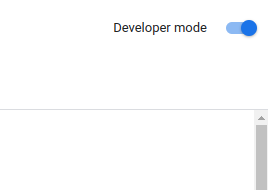
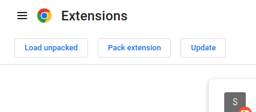
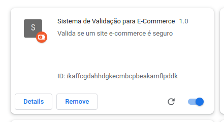
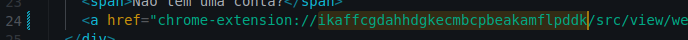
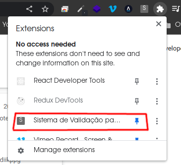

### sis-val-ecommerce

# Proposta do trabalho:

1- Implementar um MVP do projeto apresentado e disponibilizar acesso ao projeto ou ao código-fonte. Pode-se, também, gravar um vídeo mostrando a execução do sistema, simulando algum caso de uso.

2- Identificar no projeto, padrões utilizados, conforme descritos por Fowler ou GoF.
  - 1º padrão identificado: `Padrão MVC (Model View Controller)`
      - [Model](https://github.com/afpaiva/sis-val-ecommerce/tree/main/src/models)
      - [View](https://github.com/afpaiva/sis-val-ecommerce/tree/main/src/view)
      - [Controller](https://github.com/afpaiva/sis-val-ecommerce/tree/main/src/view)
  - 2º padrão identificado: `Padrão Microkernel (ou Plugin)`
      - Pois permite o acoplamento de features ao core da aplicação (considerando *core* o navegador, em se tratando de uma extensão).

# Preparação do ambiente de desenvolvimento:

1- Utilize o navegador Chrome

2- Acesse `chrome://extensions/`

3- Ative o modo desenvolvedor no canto superior direito:

4- Clique em `Load Unpacked` e aponte para pasta a raíz do projeto:

5-  Copie o `ID`

6- Troque em todos os arquivos `html` que façam referência a ele:

7- A extensão poderá ser acessada pela barra de pesquisa do navegador:

# Alguns Casos de Uso:

## Informar uma compra:

1- O Consumidor receberá um formulário;

2- O Consumidor preencherá o formulário detalhando o produto comprado e confirmando que uma compra foi realizada em determinada loja;

3- O Consumidor enviara o formulário ao sistema;

4- O sistema irá validar se a compra foi realmente realizada consultando a loja cadastrada;

4.1- Se válida: O Consumidor receberá uma mensagem de agradecimento pela contribuição.

4.2- Se não válida: O Consumidor receberá uma mensagem de alerta o instruindo a revisar os dados do formulário ou cancelar a operação.

## Compartilhar experiência de compra:

1- O Consumidor faz login na plataforma;

2- O Consumidor localiza a compra realizada e confirmada pelo sistema;

3- O Consumidor clica no botão “Compartilhar Experiência”;

4- O Consumidor preenche o formulário, dá sua nota à sua experiência de compra e faz o envio;

## Criar permalink:

1- O Consumidor faz login na plataforma;

2- O Consumidor vai na opção de criar permalink;

3- O Consumidor será encaminhado à uma tela com o permalink e botões para compartilhar em redes sociais ou copiar para a área de transferência.
